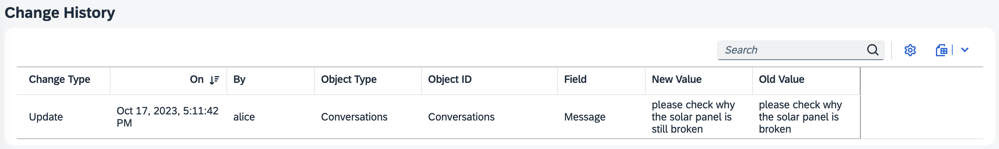
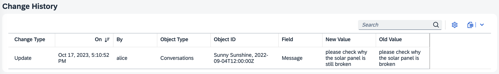
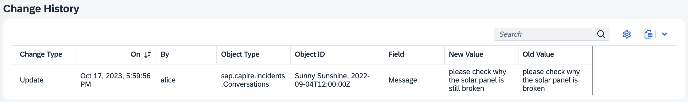
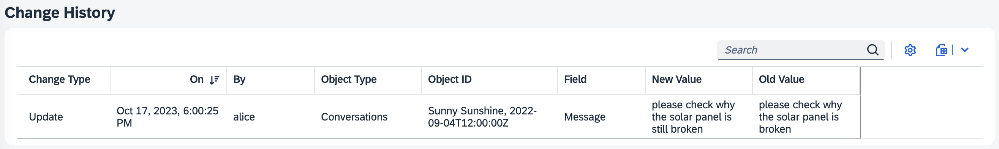
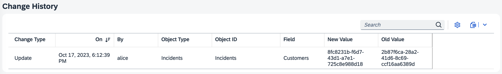
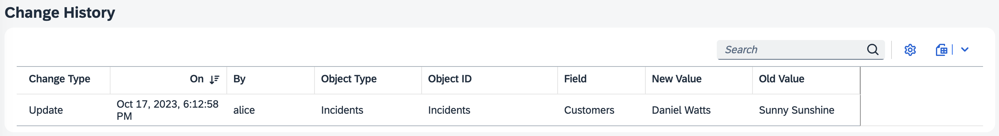

# Welcome to @cap-js/change-tracking

## About this project

`@cap-js/change-tracking` is a [CDS plugin](https://cap.cloud.sap/docs/node.js/cds-plugins#cds-plugin-packages) providing out-of-the box support for automatic capturing, storing, and viewing of the change records of modeled entities.

## Table of Contents

- [Welcome to @cap-js/change-tracking](#welcome-to-cap-jschange-tracking)
  - [About this project](#about-this-project)
  - [Table of Contents](#table-of-contents)
  - [Usage](#usage)
    - [Add the CDS Plugin](#add-the-cds-plugin)
    - [Annotate with `@changelog`](#annotate-with-changelog)
      - [Human-readable IDs](#human-readable-ids)
      - [Human-readable Types and Fields](#human-readable-types-and-fields)
      - [Human-readable Values](#human-readable-values)
    - [Test-drive locally](#test-drive-locally)
    - [Change History view](#change-history-view)
    - [Customizations](#customizations)
  - [Support, Feedback, Contributing](#support-feedback-contributing)
  - [Code of Conduct](#code-of-conduct)
  - [Licensing](#licensing)


## Usage

In this guide, we use the [Incidents Management reference sample app](https://github.com/cap-js/incidents-app) as the base to add change tracking to.

### Add the CDS Plugin

To enable change tracking, simply add this self-configuring plugin package to your project:

```sh
npm add @cap-js/change-tracking
```

### Annotate with `@changelog`

Next, we need to identify what should be change-tracked by annotating respective entities and elements in our model with the `@changelog` annotation. Following the [best practice of separation of concerns](https://cap.cloud.sap/docs/guides/domain-modeling#separation-of-concerns), we do so in a separate file _srv/change-tracking.cds_:

```cds
using {
  sap.capire.incidents as my,
  ProcessorService
} from './processor-service';

annotate my.Incidents with @title: 'Incidents';
annotate my.Conversations with @title: 'Conversations';
annotate my.Customers with @title: '{i18n>Customers}';

annotate ProcessorService.Incidents {
  customer @changelog: [customer.name];
  title    @changelog;
  status   @changelog;
}

annotate ProcessorService.Conversations with @changelog: [author, timestamp] {
  message  @changelog @Common.Label: 'Message';
}
```

The minimal annotation we require to turn on change tracking is the annotation `@changelog` on an element, the annotation on the entity level is not required.

However, additional identifiers or labels may be necessary to obtain better *human-readable* change records. These are described below.

Note, that for all annotations, the common i18n rules apply.


#### Human-readable IDs

The columns *Object ID* and *Parent Object ID* are already human-readable by default, unless the `@changelog` definition cannot be uniquely mapped such as types `enum` or `Association`.

If we were to only add the `@changelog` annotation without any additional identifiers , we would get simple IDs denoting the entity as we change the `message` property:

```cds
annotate ProcessorService.Conversations {
```


However, this is not advisable as we would note be able to quickly distinguish individual changes. Hence, it is more appropriate to annotate as follows:

```cds
annotate ProcessorService.Conversations with @changelog: [author, timestamp] {
```


By choosing an additional identifiers on the changelog annotation `[author, timestamp]`, we can now more easily distinguish different change events by the the message's author and timestamp.


#### Human-readable Types and Fields

To obtain human-readable columns *Field* and *Object Type*, one can annotate with `@Common.Label` or `@title`.

If we would not annotate the entity Conversations a title, the *Object Type* column would show the raw entity name:



As this contains much redundancy in the name, we better add a title, which leads to a more human-readable *Object Type*:




#### Human-readable Values

Since without additional identifiers, *New Value* and *Old Value* column entries can also be rather cryptic. If we were to annotate `ProcessorService.Incidents` on element level as follows, we would only see UUIDs display in the value columns:

```cds
  customer @changelog;
```



Hence, here it is essential to add a unique identifier to obtain human-readable value columns:

```cds
  customer @changelog: [customer.name];
```




### Test-drive locally

With the steps above, we have successfully set up change tracking for our reference application. Let's see that in action.

1. **Start the server**:
  ```sh
  cds watch
  ```
2. **Make a change** on your change-tracked elements. This change will automatically be persisted in the database table (`sap.changelog.ChangeLog`) and made available in a pre-defined view, namely the [Change History view](#change-history-view) for your convenience.

### Change History view


If you have a Fiori Element application, the CDS plugin automatically provides and generates a view `sap.changelog.ChangeView`, the facet of which is automatically added to the Fiori Object Page of your change-tracked entities/elements. In the UI, this corresponds to the *Change History* table which serves to help you to view and search the stored change records of your modeled entities.

### Customizations

The view can be easily adapted and configured to your own needs by simply changing or extending it. For example, let's assume we only want to show the first 5 columns in equal spacing, we would extend `srv/change-tracking.cds` as follows:

```cds
using from '@cap-js/change-tracking';

annotate sap.changelog.ChangeView with @(
  UI.LineItem : [
    { Value: modification, @HTML5.CssDefaults: { width:'20%' }},
    { Value: createdAt,    @HTML5.CssDefaults: { width:'20%' }},
    { Value: createdBy,    @HTML5.CssDefaults: { width:'20%' }},
    { Value: entity,       @HTML5.CssDefaults: { width:'20%' }},
    { Value: objectID,     @HTML5.CssDefaults: { width:'20%' }}
  ]
);
```

In the UI, the *Change History* table now contains 4 equally-spaced columns with the desired properties:


For more information and examples on adding Fiori Annotations, see [Adding SAP Fiori Annotations](https://cap.cloud.sap/docs/advanced/fiori#fiori-annotations).


## Support, Feedback, Contributing

This project is open to feature requests/suggestions, bug reports etc. via [GitHub issues](https://github.com/cap-js/change-tracking/issues). Contribution and feedback are encouraged and always welcome. For more information about how to contribute, the project structure, as well as additional contribution information, see our [Contribution Guidelines](CONTRIBUTING.md).


## Code of Conduct

We as members, contributors, and leaders pledge to make participation in our community a harassment-free experience for everyone. By participating in this project, you agree to abide by its [Code of Conduct](CODE_OF_CONDUCT.md) at all times.


## Licensing

Copyright 2023 SAP SE or an SAP affiliate company and contributors. Please see our [LICENSE](LICENSE) for copyright and license information. Detailed information including third-party components and their licensing/copyright information is available [via the REUSE tool](https://api.reuse.software/info/github.com/cap-js/change-tracking).
