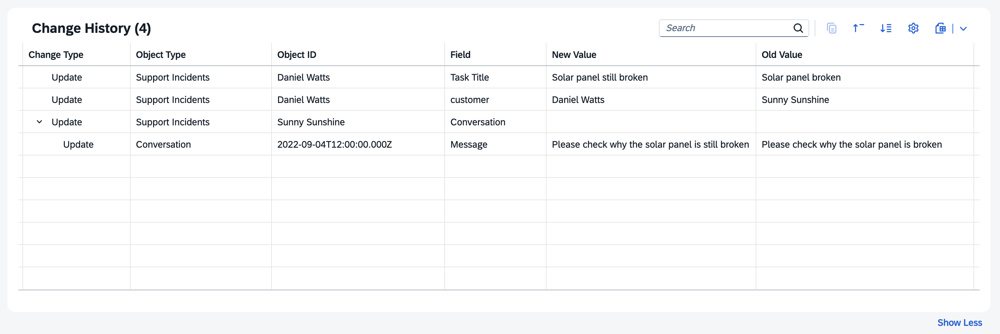
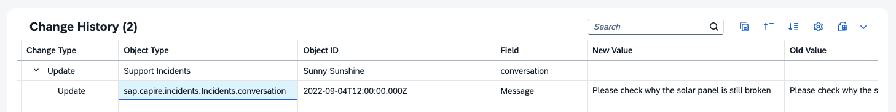
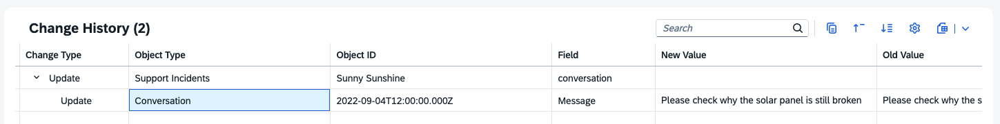
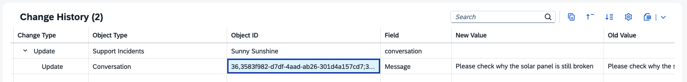
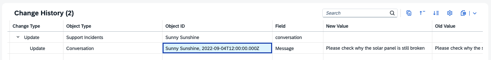
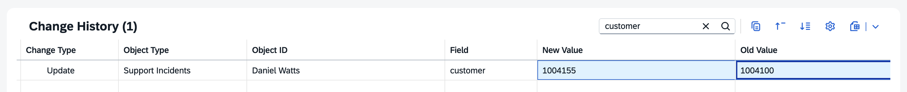
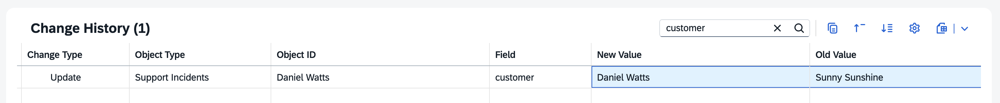
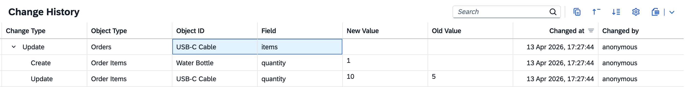
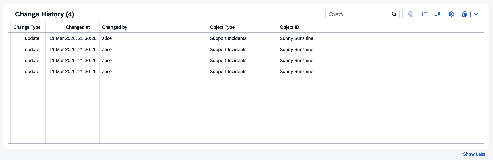

# Change Tracking Plugin for SAP Cloud Application Programming Model (CAP)

A [CDS plugin](https://cap.cloud.sap/docs/node.js/cds-plugins#cds-plugin-packages) for automatic capturing, storing, and viewing of change records for modelled entities.

[](https://api.reuse.software/info/github.com/cap-js/change-tracking)

> [!IMPORTANT]
> With version 2.0, we completely refactored how changes are tracked. Previously, the logic relied on the application layer, which limited the types of trackable queries and came with major performance penalties in larger projects. With v2.0 the changes are now fully tracked on the database layer via database triggers. Furthermore, the table definition for changes was cleaned up with v2.0. This means any upgrade involves a schema change.


### Table of Contents

- [Try it Locally](#try-it-locally)
- [Detailed Explanation](#detailed-explanation)
  - [Human-readable Types and Fields](#human-readable-types-and-fields)
  - [Human-readable IDs](#human-readable-ids)
  - [Human-readable Values](#human-readable-values)
    - [Expression-based labels](#expression-based-labels)
    - [Localized values](#localized-values)
  - [Human-readable IDs for Composition Entries](#human-readable-ids-for-composition-entries)
- [Advanced Options](#advanced-options)
  - [Altered Table View](#altered-table-view)
  - [Disable Lazy Loading](#disable-lazy-loading)
  - [Disable UI Facet generation](#disable-ui-facet-generation)
  - [Disable Association to Changes Generation](#disable-association-to-changes-generation)
- [Examples](#examples)
  - [Tracing Changes](#tracing-changes)
  - [Don&#39;ts](#donts)
- [Contributing](#contributing)
- [Code of Conduct](#code-of-conduct)
- [Licensing](#licensing)

## Try it Locally

To enable change tracking, simply add this self-configuring plugin package to your project and add the `@changelog` annotation to your data model, as explained in the [Detailed Explanation](#detailed-explanation).

```sh
npm add @cap-js/change-tracking
```

Alternatively, a full sample application is provided in the `tests/bookshop` folder:

```sh
git clone https://github.com/cap-js/change-tracking
cd change-tracking
npm i
cd tests/bookshop
cds watch
```


> [!Warning]
>
> Please note that if your project is multi-tenant, then the CDS version must be higher than 8.6 and the mtx version higher than 2.5 for change-tracking to work.

> [!Warning]
>
> When using multi-tenancy with MTX, the generated database triggers, facets and associations have to be created by the model provider of the MTX component. Therefore, the plugin also must be added to the `package.json` of the MTX sidecar. 

### Annotations

> [!WARNING]
> Please be aware that [**sensitive** or **personal** data](https://cap.cloud.sap/docs/guides/data-privacy/annotations#annotating-personal-data) (annotated with `@PersonalData`) is not change tracked, since viewing the log allows users to circumvent [audit-logging](https://cap.cloud.sap/docs/guides/data-privacy/audit-logging#setup).

All you need to do, is to identify what should be change-tracked by annotating respective entities and elements in your model with the `@changelog` annotation. Following the [best practice of separation of concerns](https://cap.cloud.sap/docs/guides/domain-modeling#separation-of-concerns), we do so in a separate file _db/change-tracking.cds_:

```cds
using { sap.capire.Incidents, sap.capire.Conversations } from './schema.cds';

annotate Incidents {
  customer @changelog: [customer.name];
  title    @changelog;
  status   @changelog;
}

annotate Conversations with @changelog: [author, timestamp] {
  message  @changelog @Common.Label: 'Message';
}
```

The minimal annotation we require for change tracking is `@changelog` on elements, as for the elements `title` and `status` in the sample snippet above.

Additional identifiers or labels can be added to obtain more *human-readable* change records as described below.

### Testing

With the steps above, we have successfully set up change tracking for our reference application. Let's see that in action.

1. **Start the server**:

```sh
cds watch
```

2. **Make a change** on your change-tracked elements. This change will automatically be persisted in the database table (`sap.changelog.Changes`) and made available in a pre-defined view, namely the [Change History view](#change-history-view) for your convenience.

#### Change History View



If you have a Fiori Element application, the CDS plugin automatically provides and generates a view `sap.changelog.ChangeView`, the facet of which is automatically added to the Fiori Object Page of your change-tracked entities/elements. In the UI, this corresponds to the *Change History* table which serves to help you to view and search the stored change records of your modeled entities.

## Detailed Explanation

### Human-readable Types and Fields

By default the implementation looks up *Object Type* names or *Field* names from respective  `@title` or  `@Common.Label` annotations and uses the technical name as a fall back.

For example, without the `@title` annotation, changes to conversation entries would show up with the technical entity name:



With an annotation, and possible i18n translations like so:

```cds
annotate Incidents.conversations with @title: '{i18n>CONVERSATION}';
```

We get a human-readable display for *Object Type*:



### Human-readable IDs

The changelog annotations for *Object ID* are defined at entity level.

Having a `@changelog` annotation without any additional identifiers, changes to conversation entries show up as simple entity IDs:



However, this is not advisable and the readability can be increased with an explicit object ID as follows:

```cds
annotate Incidents.conversation with @changelog: [author, timestamp];
```



The annotation accepts a list of paths, meaning the following examples are all possible as well:

```cds
type CustomType : String;

extend Customers with elements {
  note: CustomType
}

annotate Incidents with @changelog: [
  title, customer.note, urgency.name
];
```

```cds
annotate Incidents with @changelog: [
  customer.address.city, customer.address.streetAddress, status.criticality
] {
  title    @changelog;
}
```

### Human-readable Values

The changelog annotations for *New Value* and *Old Value* are defined at element level.

They are already human-readable by default, unless the `@changelog` definition cannot be uniquely mapped such as types `enum` or `Association`.

For example, having a `@changelog` annotation on Incident's `customer` field without any additional identifiers, changes would show up as UUIDs:

```cds
customer @changelog;
```



Hence, here it is essential to add a unique identifier to obtain human-readable value columns:

```cds
customer @changelog: [customer.name];
```



### Human-readable IDs for Composition Entries

When a child entity is modified, a composition changelog entry is created on the parent entity with `valueDataType = 'cds.Composition'`. The *Object ID* of this composition entry is automatically derived from the **child entity's** `@changelog` annotation, identifying which child was affected.

For example, given the following model:

```cds
entity Orders {
  key ID    : UUID;
  orderNo   : String;
  items     : Composition of many OrderItems on items.order = $self;
}

entity OrderItems {
  key ID    : UUID;
  order     : Association to Orders;
  product   : String;
  quantity  : Integer;
}
```

With these annotations:

```cds
annotate Orders with @changelog: [orderNo] {
  items @changelog;
}

annotate OrderItems with @changelog: [product] {
  quantity @changelog;
}
```

Results to the following change logs:


> [!NOTE]
> When multiple children are created or deleted in a single transaction, only one composition entry is created per parent. Its *Object ID* will reflect the first child processed.

#### Expression-based labels

In addition to plain paths, the `@changelog` annotation supports CDS expressions for computing human-readable labels. Expressions must be wrapped in parentheses `()` to distinguish them from paths:

```cds
annotate Incidents {
  status @changelog: (status.code || ': ' || status.descr);
  price  @changelog: (price < 100 ? 'Budget' : 'Premium');
}
```

When `status` changes from `N` (New) to `R` (Resolved), the label would show `"N: New"` and `"R: Resolved"` instead of raw key values. For `price`, a ternary expression classifies the value into a human-readable category.


#### Localized values
If a human-readable value is annotated for the changelog, it will be localized.

```cds
extend Incidents with elements {
  status: Association to one Status @changelog: [status.descr];
}

entity Status {
  key code: String(1);
      descr: localized String(20);
}
```

By default the value label stored for the change is localized in the language of the user who caused the change. Meaning if a German speaking user changes the status, the human-readable value would be by default in German.

In cases, like above, where the human-readable value only consists of one field, targets a localized property and goes along the (un-)managed association, a dynamic human-readable value is used, meaning if an English-speaking user looks at the changes, the value label will be shown in English, for a French-speaking user in French and so on.

### Tracing any kind of change

Change tracking is implemented with Database triggers and supports HANA Cloud, SQLite, Postgres and H2.

Leveraging database triggers means any change will be tracked no matter how it is represented in the service. Thus tracking changes made via unions, or via views with joins will still work.

#### Tracking datetime fields with a fixed time zone

The plugin supports tracking datetime field changes when the field has a time zone annotated.

```cds
extend Incidents with elements {
  closedAt : DateTime @changelog @Common.Timezone : 'Europe/Berlin';
  openedAt : DateTime @changelog @Common.Timezone : openedTimeZone;
  openedTimeZone : String @Common.IsTimezone;
}
```

In both cases the plugin will show the annotated time zone for change values in changes for the two fields. In the second case the time zone is dynamically fetched and modifications to the time zone field will also reflect in the change records for that field.

## Advanced Options

### Altered table view

The *Change History* view can be easily adapted and configured to your own needs by simply changing or extending it. For example, let's assume we only want to show the first 5 columns in equal spacing, we would extend `db/change-tracking.cds` as follows:

```cds
using from '@cap-js/change-tracking';

annotate sap.changelog.ChangeView with @(
  UI.LineItem : [
    { Value: modificationLabel },
    { Value: createdAt },
    { Value: createdBy },
    { Value: entityLabel },
    { Value: objectID }
  ]
);
```

In the UI, the *Change History* table now contains only the five columns with the desired properties:



For more information and examples on adding Fiori Annotations, see [Adding SAP Fiori Annotations](https://cap.cloud.sap/docs/advanced/fiori#fiori-annotations).

### Disable lazy loading

To disable the lazy loading feature of the *Change History* table, you can add the following annotation to your `db/change-tracking.cds`:

```cds
using from '@cap-js/change-tracking';

annotate sap.changelog.aspect @(UI.Facets: [{
  $Type : 'UI.ReferenceFacet',
  ID    : 'ChangeHistoryFacet',
  Label : '{i18n>ChangeHistory}',
  Target: 'changes/@UI.PresentationVariant',
  @UI.PartOfPreview
}]);
```

The system now uses the SAP Fiori elements default setting `@UI.PartOfPreview: true`, such that the table will always be shown when navigating to that respective Object page.

### Disable UI Facet generation

If you do not want the auto-provided UI facet for viewing changes, you can provide your own facet for the `changes` association in the `@UI.Facets` annotation and the plugin won't override it.

Furthermore if you annotate the association as not readable, the facet is also not added. You can achive this, like 

```cds
@Capabilities.NavigationRestrictions.RestrictedProperties : [
  {
    NavigationProperty : changes,
    ReadRestrictions : {
      Readable : false,
    },
  },
]
entity SalesOrders {
  key ID : Int16;
      title  : String @changelog;
}
```

### Disable Association to Changes Generation

For some scenarios, e.g. when doing `UNION` and the `@changelog` annotation is still propagated, the automatic addition of the association to `changes` does not make sense. You can use `@changelog.disable_assoc`for this to be disabled on entity level.

> [!IMPORTANT]
> This will also suppress the addition of the UI facet, since the change-view is no longer available as the target entity.

### Select types of changes to track

If you do not want to track some types of changes, you can disable them using `disableCreateTracking`, `disableUpdateTracking`
and `disableDeleteTracking` configs in your project settings:
```json
{
  "cds": {
    "requires": {
      "change-tracking": {
        "disableCreateTracking": true,
        "disableUpdateTracking": false,
        "disableDeleteTracking": true
      }
    }
  }
}
```

### Preserve change logs of deleted data

By default, deleting a record will also automatically delete all associated change logs. This helps reduce the impact on the size of the database.
You can turn this behavior off globally by adding the following switch to the `package.json` of your project

```json
"cds": {
  "requires": {
    "change-tracking": {
      "preserveDeletes": true
    }
  }
}
```

> [!IMPORTANT]
> Preserving the change logs of deleted data can have a significant impact on the size of the change logging table, since now such data also survives automated data retention runs. 
> You must implement an own **data retention strategy** for the change logging table in order to manage the size and performance of your database.

### Adjust the depth of the entity hierarchy tracking

By default, the depth of the changes hierarchy for any entity is 3. This means, its changes as well as the changes of its compositions and the compositions of its compositions are shown on the UI.

```json
"cds": {
  "requires": {
    "change-tracking": {
      "maxDisplayHierarchyDepth": 3
    }
  }
}
```

> [!IMPORTANT]
> The depth of the hierarchy has a performance impact, so be careful with increasing it!

### Tracking localized values

Localized properties, like `descr` in the example, are respected and the localized value during change log creation is used for the label.

```cds
entity Incidents : cuid, managed {
  // … more fields
  status         : Association to Status default 'N' @changelog : [status.descr];
}

entity Status {
  key code    : String:
  descr : localized String;
}
```

Please be aware this means the localized value is then stored and shown in the change log, e.g. if a user speaking another language accesses the change log later, they will still see the value in the language used by the user who caused the change log.

## Examples

This section describes modelling cases for further reference, from simple to complex, including the following:

- [Tracing Changes](#tracing-changes)
  - [Use Case 1: Trace the changes of child nodes from the current entity and display the meaningful data from child nodes (composition relation)](#use-case-1-trace-the-changes-of-child-nodes-from-the-current-entity-and-display-the-meaningful-data-from-child-nodes-composition-relation)
  - [Use Case 2: Trace the changes of associated entities from the current entity and display the meaningful data from associated entities (association relation)](#use-case-2-trace-the-changes-of-associated-entities-from-the-current-entity-and-display-the-meaningful-data-from-associated-entities-association-relation)
  - [Use Case 3: Trace the changes of chained associated entities from the current entity and display the meaningful data from associated entities (association relation)](#use-case-3-trace-the-changes-of-chained-associated-entities-from-the-current-entity-and-display-the-meaningful-data-from-associated-entities-association-relation)
- [Don&#39;ts](#donts)
  - [Use Case 1: Don&#39;t trace changes for field(s) with `Association to many`](#use-case-1-dont-trace-changes-for-fields-with-association-to-many)
  - [Use Case 2: Don&#39;t trace changes for field(s) with *Unmanaged Association*](#use-case-2-dont-trace-changes-for-fields-with-unmanaged-association)

### Tracing Changes

Use cases for tracing changes

#### Use Case 1: Trace the changes of child nodes from the current entity and display the meaningful data from child nodes (composition relation)

Modelling in `db/schema.cds`

```cds
entity Incidents : managed, cuid {
  ...
  title          : String @title: 'Title';
  conversation   : Composition of many Conversation;
  ...
}

aspect Conversation: managed, cuid {
    ...
    message   : String;
}
```

Add the following `@changelog` annotations in `db/change-tracking.cds`

```cds
annotate Incidents with @changelog: [title] {
  conversation @changelog;
}

annotate Conversation with @changelog: [message] {
  message @changelog;
}
```

When a `Conversation` entry is modified, the composition changelog entry on `Incidents` will automatically use the child's *Object ID* derived from `Conversation @changelog: [message]`. This way, the change history on the parent shows which conversation was affected.

#### Use Case 2: Trace the changes of associated entities from the current entity and display the meaningful data from associated entities (association relation)

Modelling in `db/schema.cds`

```cds
entity Incidents : cuid, managed {
  ...
  customer       : Association to Customers;
  title          : String @title: 'Title';
  ...
}

entity Customers : cuid, managed {
  ...
  email          : EMailAddress;
  ...
}
```

Add the following `@changelog` annotations in `db/change-tracking.cds`

```cds
annotate Incidents with @changelog: [title] {
  customer @changelog: [customer.email];
}
```

#### Use Case 3: Trace the changes of chained associated entities from the current entity and display the meaningful data from associated entities (association relation)

Modelling in `db/schema.cds`

```cds
entity Incidents : cuid, managed {
  ...
  title          : String @title: 'Title';
  customer       : Association to Customers;
  ...
}

entity Customers : cuid, managed {
  ...
  address : Composition of one Addresses;
  ...
}
```

Add the following `@changelog` annotations in `db/change-tracking.cds`

```cds
annotate Incidents with @changelog: [title] {
  customer @changelog: [customer.address.city, customer.address.streetAddress];
}
```

> Change-tracking supports analyzing chained associated entities from the current entity in case the entity in consumer applications is a pure relation table. However, the usage of chained associated entities is not recommended due to performance cost.

---

### 🛑 Don'ts


#### Use Case 1: Don't trace changes for field(s) with `Association to many`

```cds
entity Customers : cuid, managed {
  ...
  incidents : Association to many Incidents on incidents.customer = $self;
}
```

The reason is that: the relationship: `Association to many` is only for modelling purpose and there is no concrete field in database table. In the above sample, there is no column for incidents in the table Customers, but there is a navigation property of incidents in Customers OData entity metadata.

#### Use Case 2: Don't trace changes for field(s) with *Unmanaged Association*

```cds
entity AggregatedBusinessTransactionData @(cds.autoexpose) : cuid {
    FootprintInventory: Association to one FootprintInventories
                        on  FootprintInventory.month                      = month
                        and FootprintInventory.year                       = year
                        and FootprintInventory.FootprintInventoryScope.ID = FootprintInventoryScope.ID;
    ...
}
```

The reason is that: When deploying to relational databases, Associations are mapped to foreign keys. Yet, when mapped to non-relational databases they're just references. More details could be found in [Prefer Managed Associations](https://cap.cloud.sap/docs/guides/domain-models#managed-associations). In the above sample, there is no column for FootprintInventory in the table AggregatedBusinessTransactionData, but there is a navigation property FootprintInventory of in OData entity metadata.


## Contributing

This project is open to feature requests/suggestions, bug reports etc. via [GitHub issues](https://github.com/cap-js/change-tracking/issues). Contribution and feedback are encouraged and always welcome. For more information about how to contribute, the project structure, as well as additional contribution information, see our [Contribution Guidelines](CONTRIBUTING.md).

## Code of Conduct

We as members, contributors, and leaders pledge to make participation in our community a harassment-free experience for everyone. By participating in this project, you agree to abide by its [Code of Conduct](CODE_OF_CONDUCT.md) at all times.

## Licensing

Copyright 2023 SAP SE or an SAP affiliate company and contributors. Please see our [LICENSE](LICENSE) for copyright and license information. Detailed information including third-party components and their licensing/copyright information is available [via the REUSE tool](https://api.reuse.software/info/github.com/cap-js/change-tracking).
