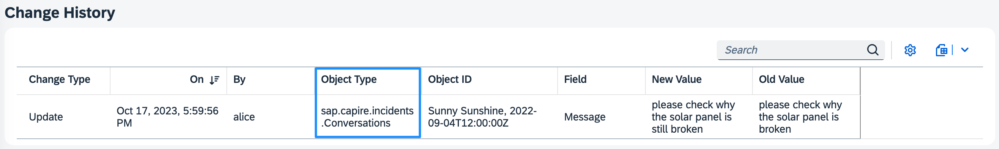
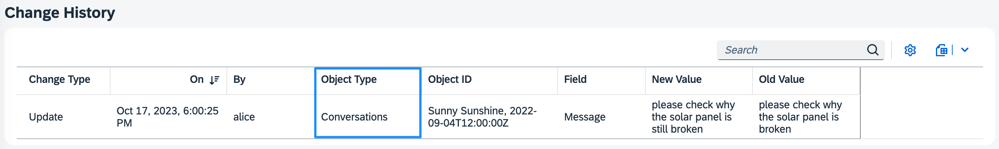
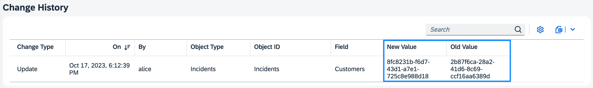
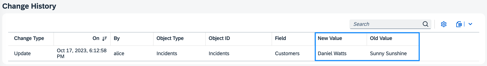

# Change Tracking Plugin for SAP Cloud Application Programming Model (CAP)

a [CDS plugin](https://cap.cloud.sap/docs/node.js/cds-plugins#cds-plugin-packages) for automatic capturing, storing, and viewing of the change records of modeled entities

[](https://api.reuse.software/info/github.com/cap-js/change-tracking)

> [!IMPORTANT]
> This release establishes support for multi-tenant deployments using MTX and extensibility.
> This release establishes support for multi-tenant deployments using MTX and extensibility.
> 
> To achieve this, the code was modified significantly. While we tested extensively, there still may be glitches or unexpected situations which we did not cover. So please **test this release extensively before applying it to productive** scenarios. Please also report any bugs or glitches, ideally by contributing a test-case for us to incorporate.
> To achieve this, the code was modified significantly. While we tested extensively, there still may be glitches or unexpected situations which we did not cover. So please **test this release extensively before applying it to productive** scenarios. Please also report any bugs or glitches, ideally by contributing a test-case for us to incorporate.
> 
> See the changelog for a full list of changes

> [!Warning]
>
> When using multi-tenancy with MTX, the generated facets and associations have to be created by the model provider of the MTX component. Therefore, the plugin also must be added to the `package.json` of the MTX sidecar. 
>Although we tested this scenario extensively, there still might be cases where the automatic generation will not work as expected. If this happends in your scenario, we suggest using the `@changelog.disable_assoc` ([see here](#disable-association-to-changes-generation)) for all tracked entities and to add the association and facet manually to the service entity.
> When using multi-tenancy with MTX, the generated facets and associations have to be created by the model provider of the MTX component. Therefore, the plugin also must be added to the `package.json` of the MTX sidecar. 
>Although we tested this scenario extensively, there still might be cases where the automatic generation will not work as expected. If this happends in your scenario, we suggest using the `@changelog.disable_assoc` ([see here](#disable-association-to-changes-generation)) for all tracked entities and to add the association and facet manually to the service entity.


### Table of Contents

- [Try it Locally](#try-it-locally)
- [Detailed Explanation](#detailed-explanation)
  - [Human-readable Types and Fields](#human-readable-types-and-fields)
  - [Human-readable IDs](#human-readable-ids)
  - [Human-readable Values](#human-readable-values)
- [Advanced Options](#advanced-options)
  - [Altered Table View](#altered-table-view)
  - [Disable Lazy Loading](#disable-lazy-loading)
  - [Disable UI Facet generation](#disable-ui-facet-generation)
    - [Disable Association to Changes Generation](#disable-association-to-changes-generation)
- [Examples](#examples)
  - [Specify Object ID](#specify-object-id)
  - [Tracing Changes](#tracing-changes)
  - [Don&#39;ts](#donts)
- [Contributing](#contributing)
- [Code of Conduct](#code-of-conduct)
- [Licensing](#licensing)

## Try it Locally

In this guide, we use the [Incidents Management reference sample app](https://github.com/cap-js/incidents-app) as the base to add change tracking to.

1. [Prerequisites](#1-prerequisites)
2. [Setup](#2-setup)
3. [Annotations](#3-annotations)
4. [Testing](#4-testing)

### 1. Prerequisites

Clone the repository and apply the step-by-step instructions:

```sh
git clone https://github.com/cap-js/incidents-app
cd incidents-app
npm i
```

**Alternatively**, you can clone the incidents app including the prepared enhancements for change-tracking:

```sh
git clone https://github.com/cap-js/calesi --recursive
cd calesi
npm i
```

```sh
cds w samples/change-tracking
```

### 2. Setup

To enable change tracking, simply add this self-configuring plugin package to your project:

```sh
npm add @cap-js/change-tracking
```
If you use multi-tenancy, please add the plugin also to the MTX poroject.
If you use multi-tenancy, please add the plugin also to the MTX poroject.

### 3. Annotations

> [!WARNING]
> Please be aware that [**sensitive** or **personal** data](https://cap.cloud.sap/docs/guides/data-privacy/annotations#annotating-personal-data) (annotated with `@PersonalData`) is not change tracked, since viewing the log allows users to circumvent [audit-logging](https://cap.cloud.sap/docs/guides/data-privacy/audit-logging#setup).

All we need to do is to identify what should be change-tracked by annotating respective entities and elements in our model with the `@changelog` annotation. Following the [best practice of separation of concerns](https://cap.cloud.sap/docs/guides/domain-modeling#separation-of-concerns), we do so in a separate file _srv/change-tracking.cds_:

```cds
using { ProcessorService } from './processor-service';

annotate ProcessorService.Incidents {
  customer @changelog: [customer.name];
  title    @changelog;
  status   @changelog;
}

annotate ProcessorService.Conversations with @changelog: [author, timestamp] {
  message  @changelog @Common.Label: 'Message';
}
```

The minimal annotation we require for change tracking is `@changelog` on elements, as for the elements `title` and `status` in the sample snippet above.

Additional identifiers or labels can be added to obtain more *human-readable* change records as described below.

### 4. Testing

With the steps above, we have successfully set up change tracking for our reference application. Let's see that in action.

1. **Start the server**:

```sh
cds watch
```

2. **Make a change** on your change-tracked elements. This change will automatically be persisted in the database table (`sap.changelog.ChangeLog`) and made available in a pre-defined view, namely the [Change History view](#change-history-view) for your convenience.

#### Change History View

> [!IMPORTANT]
> To ensure proper lazy loading of the Change History table, please use **SAPUI5 version 1.120.0** or higher.`<br>`
> If you wish to *disable* this feature, please see the customization section on how to [disable lazy loading](#disable-lazy-loading).


If you have a Fiori Element application, the CDS plugin automatically provides and generates a view `sap.changelog.ChangeView`, the facet of which is automatically added to the Fiori Object Page of your change-tracked entities/elements. In the UI, this corresponds to the *Change History* table which serves to help you to view and search the stored change records of your modeled entities.

## Detailed Explanation

### Human-readable Types and Fields

By default the implementation looks up *Object Type* names or *Field* names from respective  `@title` or  `@Common.Label` annotations, and applies i18n lookups. If no such annotations are given, the technical names of the respective CDS definitions are displayed.

For example, without the `@title` annotation, changes to conversation entries would show up with the technical entity name:



With an annotation, and possible i18n translations like so:

```cds
annotate Conversations with @title: 'Conversations';
```

We get a human-readable display for *Object Type*:



### Human-readable IDs

The changelog annotations for *Object ID* are defined at entity level.

These are already human-readable by default, unless the `@changelog` definition cannot be uniquely mapped such as types `enum` or `Association`.

For example, having a `@changelog` annotation without any additional identifiers, changes to conversation entries would show up as simple entity IDs:


However, this is not advisable as we cannot easily distinguish between changes. It is more appropriate to annotate as follows:

```cds
annotate ProcessorService.Conversations with @changelog: [author, timestamp] {
```


Expanding the changelog annotation by additional identifiers `[author, timestamp]`, we can now better identify the `message` change events by their respective author and timestamp.

### Human-readable Values

The changelog annotations for *New Value* and *Old Value* are defined at element level.

They are already human-readable by default, unless the `@changelog` definition cannot be uniquely mapped such as types `enum` or `Association`.

For example, having a `@changelog` annotation without any additional identifiers, changes to incident customer would show up as UUIDs:

```cds
customer @changelog;
```



Hence, here it is essential to add a unique identifier to obtain human-readable value columns:

```cds
customer @changelog: [customer.name];
```



## Advanced Options

### Altered table view

The *Change History* view can be easily adapted and configured to your own needs by simply changing or extending it. For example, let's assume we only want to show the first 5 columns in equal spacing, we would extend `srv/change-tracking.cds` as follows:

```cds
using from '@cap-js/change-tracking';

annotate sap.changelog.ChangeView with @(
  UI.LineItem : [
    { Value: modification, @HTML5.CssDefaults: { width:'20%' }},
    { Value: createdAt,    @HTML5.CssDefaults: { width:'20%' }},
    { Value: createdBy,    @HTML5.CssDefaults: { width:'20%' }},
    { Value: entity,       @HTML5.CssDefaults: { width:'20%' }},
    { Value: objectID,     @HTML5.CssDefaults: { width:'20%' }}
  ]
);
```

In the UI, the *Change History* table now contains 5 equally-spaced columns with the desired properties:


For more information and examples on adding Fiori Annotations, see [Adding SAP Fiori Annotations](https://cap.cloud.sap/docs/advanced/fiori#fiori-annotations).

### Disable lazy loading

To disable the lazy loading feature of the *Change History* table, you can add the following annotation to your `srv/change-tracking.cds`:

```cds
using from '@cap-js/change-tracking';

annotate sap.changelog.aspect @(UI.Facets: [{
  $Type : 'UI.ReferenceFacet',
  ID    : 'ChangeHistoryFacet',
  Label : '{i18n>ChangeHistory}',
  Target: 'changes/@UI.PresentationVariant',
  ![@UI.PartOfPreview]
}]);
```

The system now uses the SAPUI5 default setting `![@UI.PartOfPreview]: true`, such that the table will always shown when navigating to that respective Object page.

### Disable UI Facet generation

If you do not want the UI facet added to a specific UI, you can annotate the service entity with `@changelog.disable_facet`. This will disable the automatic addition of the UI faced to this specific entity, but also all views or further projections up the chain.

### Disable Association to Changes Generation

For some scenarios, e.g. when doing `UNION` and the `@changelog` annotion is still propageted, the automatic addition of the association to `changes` does not make sense. You can use `@changelog.disable_assoc`for this to be disabled on entity level.

> [!IMPORTANT]
> This will also supress the addition of the UI facet, since the change-view is not available as target entity anymore.

### Preserve change logs of deleted data

By default, deleting a record will also automatically delete all associated change logs. This helps reduce the impact on the size of the database.
You can turn this behavior off globally by adding the following switch to the `package.json` of your project

```
...
"cds": {
  "requires": {
    ...
    "change-tracking": {
      "preserveDeletes": true
    }
   ...
  }
}
...
```
> [!IMPORTANT]
> Preserving the change logs of deleted data can have a significant impact on the size of the change logging table, since now such data also survives automated data retention runs. 
> You must implement an own **data retention strategy** for the change logging table in order to manage the size and performance of your database.

## Examples

This section describes modelling cases for further reference, from simple to complex, including the following:

  - [Examples](#examples)
    - [Specify Object ID](#specify-object-id)
      - [Use Case 1: Annotate single field/multiple fields of associated table(s) as the Object ID](#use-case-1-annotate-single-fieldmultiple-fields-of-associated-tables-as-the-object-id)
      - [Use Case 2: Annotate single field/multiple fields of project customized types as the Object ID](#use-case-2-annotate-single-fieldmultiple-fields-of-project-customized-types-as-the-object-id)
      - [Use Case 3: Annotate chained associated entities from the current entity as the Object ID](#use-case-3-annotate-chained-associated-entities-from-the-current-entity-as-the-object-id)
    - [Tracing Changes](#tracing-changes)
      - [Use Case 1: Trace the changes of child nodes from the current entity and display the meaningful data from child nodes (composition relation)](#use-case-1-trace-the-changes-of-child-nodes-from-the-current-entity-and-display-the-meaningful-data-from-child-nodes-composition-relation)
      - [Use Case 2: Trace the changes of associated entities from the current entity and display the meaningful data from associated entities (association relation)](#use-case-2-trace-the-changes-of-associated-entities-from-the-current-entity-and-display-the-meaningful-data-from-associated-entities-association-relation)
      - [Use Case 3: Trace the changes of fields defined by project customized types and display the meaningful data](#use-case-3-trace-the-changes-of-fields-defined-by-project-customized-types-and-display-the-meaningful-data)
      - [Use Case 4: Trace the changes of chained associated entities from the current entity and display the meaningful data from associated entities (association relation)](#use-case-4-trace-the-changes-of-chained-associated-entities-from-the-current-entity-and-display-the-meaningful-data-from-associated-entities-association-relation)
      - [Use Case 5: Trace the changes of union entity and display the meaningful data](#use-case-5-trace-the-changes-of-union-entity-and-display-the-meaningful-data)
    - [Don'ts](#donts)
      - [Use Case 1: Don't trace changes for field(s) with `Association to many`](#use-case-1-dont-trace-changes-for-fields-with-association-to-many)
      - [Use Case 2: Don't trace changes for field(s) with *Unmanaged Association*](#use-case-2-dont-trace-changes-for-fields-with-unmanaged-association)
      - [Use Case 3: Don't trace changes for CUD on DB entity](#use-case-3-dont-trace-changes-for-cud-on-db-entity)
  - [Contributing](#contributing)
  - [Code of Conduct](#code-of-conduct)
  - [Licensing](#licensing)

### Specify Object ID

Use cases for Object ID annotation

#### Use Case 1: Annotate single field/multiple fields of associated table(s) as the Object ID

Modelling in `db/schema.cds`

```cds
entity Incidents : cuid, managed {
  ...
  customer       : Association to Customers;
  title          : String @title: 'Title';
  urgency        : Association to Urgency default 'M';
  status         : Association to Status default 'N';
  ...
}
```

Add the following `@changelog` annotations in `srv/change-tracking.cds`

```cds
annotate ProcessorService.Incidents with @changelog: [customer.name, urgency.code, status.criticality] {
  title    @changelog;
}
```


#### Use Case 2: Annotate single field/multiple fields of project customized types as the Object ID

Modelling in `db/schema.cds`

```cds
entity Incidents : cuid, managed {
  ...
  customer       : Association to Customers;
  title          : String @title: 'Title';
  ...
}

entity Customers : cuid, managed {
  ...
  email          : EMailAddress;  // customized type
  phone          : PhoneNumber;   // customized type
  ...
}
```

Add the following `@changelog` annotations in `srv/change-tracking.cds`

```cds
annotate ProcessorService.Incidents with @changelog: [customer.email, customer.phone] {
  title    @changelog;
}
```


#### Use Case 3: Annotate chained associated entities from the current entity as the Object ID

Modelling in `db/schema.cds`

```cds
entity Incidents : cuid, managed {
  ...
  customer       : Association to Customers;
  ...
}

entity Customers : cuid, managed {
  ...
  addresses : Association to Addresses;
  ...
}
```

Add the following `@changelog` annotations in `srv/change-tracking.cds`

```cds
annotate ProcessorService.Incidents with @changelog: [customer.addresses.city, customer.addresses.postCode] {
  title    @changelog;
}
```


> Change-tracking supports annotating chained associated entities from the current entity as object ID of current entity in case the entity in consumer applications is a pure relation table. However, the usage of chained associated entities is not recommended due to performance cost.

### Tracing Changes

Use cases for tracing changes

#### Use Case 1: Trace the changes of child nodes from the current entity and display the meaningful data from child nodes (composition relation)

Modelling in `db/schema.cds`

```cds
entity Incidents : managed, cuid {
  ...
  title          : String @title: 'Title';
  conversation   : Composition of many Conversation;
  ...
}

aspect Conversation: managed, cuid {
    ...
    message   : String;
}
```

Add the following `@changelog` annotations in `srv/change-tracking.cds`

```cds
annotate ProcessorService.Incidents with @changelog: [title] {
  conversation @changelog: [conversation.message];
}
```


#### Use Case 2: Trace the changes of associated entities from the current entity and display the meaningful data from associated entities (association relation)

Modelling in `db/schema.cds`

```cds
entity Incidents : cuid, managed {
  ...
  customer       : Association to Customers;
  title          : String @title: 'Title';
  ...
}

entity Customers : cuid, managed {
  ...
  email          : EMailAddress;
  ...
}
```

Add the following `@changelog` annotations in `srv/change-tracking.cds`

```cds
annotate ProcessorService.Incidents with @changelog: [title] {
  customer @changelog: [customer.email];
}
```


#### Use Case 3: Trace the changes of fields defined by project customized types and display the meaningful data

Modelling in `db/schema.cds`

```cds
type StatusType : Association to Status;

entity Incidents : cuid, managed {
  ...
  title          : String @title: 'Title';
  status         : StatusType default 'N';
  ...
}
```

Add the following `@changelog` annotations in `srv/change-tracking.cds`

```cds
annotate ProcessorService.Incidents with @changelog: [title] {
  status   @changelog: [status.code];
}
```


#### Use Case 4: Trace the changes of chained associated entities from the current entity and display the meaningful data from associated entities (association relation)

Modelling in `db/schema.cds`

```cds
entity Incidents : cuid, managed {
  ...
  title          : String @title: 'Title';
  customer       : Association to Customers;
  ...
}

entity Customers : cuid, managed {
  ...
  addresses : Association to Addresses;
  ...
}
```

Add the following `@changelog` annotations in `srv/change-tracking.cds`

```cds
annotate ProcessorService.Incidents with @changelog: [title] {
  customer @changelog: [customer.addresses.city, customer.addresses.streetAddress];
}
```


> Change-tracking supports analyzing chained associated entities from the current entity in case the entity in consumer applications is a pure relation table. However, the usage of chained associated entities is not recommended due to performance cost.

#### Use Case 5: Trace the changes of union entity and display the meaningful data

`Payable.cds`:

```cds
entity Payables : cuid {
    displayId    : String;
    @changelog
    name         : String;
    cryptoAmount : Decimal;
    fiatAmount   : Decimal;
};
```

`Payment.cds`:

```cds
entity Payments : cuid {
    displayId : String; //readable ID
    @changelog
    name      : String;
};
```

Union entity in `BusinessTransaction.cds`:

```cds
entity BusinessTransactions          as(
    select from payments.Payments{
        key ID,
            displayId,
            name,
            changes  : Association to many ChangeView
                on changes.objectID = ID AND changes.entity = 'payments.Payments'
    }
)
union all
(
    select from payables.Payables {
        key ID,
            displayId,
            name,
            changes  : Association to many ChangeView
               on changes.objectID = ID AND changes.entity = 'payables.Payables'
    }
);
```


### Don'ts

Don'ts

#### Use Case 1: Don't trace changes for field(s) with `Association to many`

```cds
entity Customers : cuid, managed {
  ...
  incidents : Association to many Incidents on incidents.customer = $self;
}
```

The reason is that: the relationship: `Association to many` is only for modelling purpose and there is no concrete field in database table. In the above sample, there is no column for incidents in the table Customers, but there is a navigation property of incidents in Customers OData entity metadata.

#### Use Case 2: Don't trace changes for field(s) with *Unmanaged Association*

```cds
entity AggregatedBusinessTransactionData @(cds.autoexpose) : cuid {
    FootprintInventory: Association to one FootprintInventories
                        on  FootprintInventory.month                      = month
                        and FootprintInventory.year                       = year
                        and FootprintInventory.FootprintInventoryScope.ID = FootprintInventoryScope.ID;
    ...
}
```

The reason is that: When deploying to relational databases, Associations are mapped to foreign keys. Yet, when mapped to non-relational databases they're just references. More details could be found in [Prefer Managed Associations](https://cap.cloud.sap/docs/guides/domain-models#managed-associations). In the above sample, there is no column for FootprintInventory in the table AggregatedBusinessTransactionData, but there is a navigation property FootprintInventoryof in OData entity metadata.

#### Use Case 3: Don't trace changes for CUD on DB entity

```cds
this.on("UpdateActivationStatus", async (req) =>
    // PaymentAgreementsOutgoingDb is the DB entity
    await UPDATE.entity(PaymentAgreementsOutgoingDb)
        .where({ ID: paymentAgreement.ID })
        .set({ ActivationStatus_code: ActivationCodes.ACTIVE });
);
```

The reason is that: Application level services are by design the only place where business logic is enforced. This by extension means, that it also is the only point where e.g. change-tracking would be enabled. The underlying method used to do change tracking is `req.diff` which is responsible to read the necessary before-image from the database, and this method is not available on DB level.


## Contributing

This project is open to feature requests/suggestions, bug reports etc. via [GitHub issues](https://github.com/cap-js/change-tracking/issues). Contribution and feedback are encouraged and always welcome. For more information about how to contribute, the project structure, as well as additional contribution information, see our [Contribution Guidelines](CONTRIBUTING.md).

## Code of Conduct

We as members, contributors, and leaders pledge to make participation in our community a harassment-free experience for everyone. By participating in this project, you agree to abide by its [Code of Conduct](CODE_OF_CONDUCT.md) at all times.

## Licensing

Copyright 2023 SAP SE or an SAP affiliate company and contributors. Please see our [LICENSE](LICENSE) for copyright and license information. Detailed information including third-party components and their licensing/copyright information is available [via the REUSE tool](https://api.reuse.software/info/github.com/cap-js/change-tracking).
