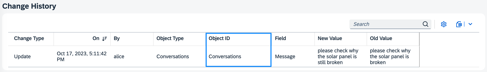
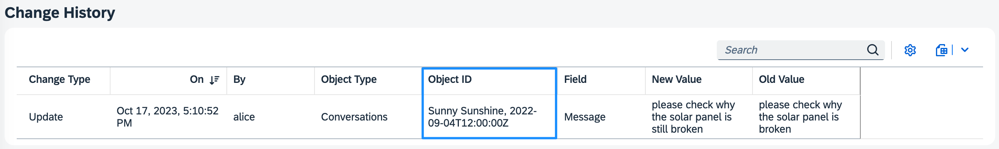
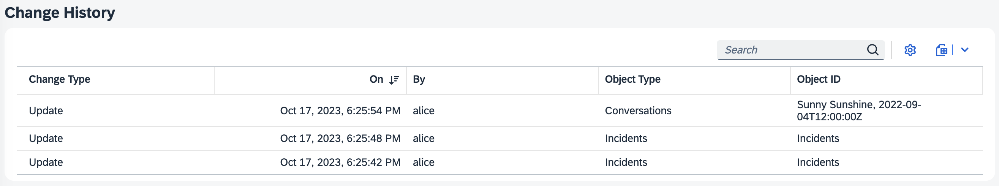

The `@cap-js/change-tracking` package is a [CDS plugin](https://cap.cloud.sap/docs/node.js/cds-plugins#cds-plugin-packages) providing out-of-the box support for automatic capturing, storing, and viewing of the change records of modeled entities.

### Table of Contents

- [Preliminaries](#preliminaries)
- [Setup](#setup)
- [Add `@changelog` Annotations](#add-changelog-annotations)
  - [Human-readable Types and Fields](#human-readable-types-and-fields)
  - [Human-readable IDs](#human-readable-ids)
  - [Human-readable Values](#human-readable-values)
- [Test-drive locally](#test-drive-locally)
- [Change History View](#change-history-view)
- [Contributing](#contributing)
- [Code of Conduct](#code-of-conduct)
- [Licensing](#licensing)


## Preliminaries

In this guide, we use the [Incidents Management reference sample app](https://github.com/cap-js/incidents-app) as the base to add change tracking to.


## Setup

To enable change tracking, simply add this self-configuring plugin package to your project:

```sh
npm add @cap-js/change-tracking
```


## Add `@changelog` Annotations

All we need to do is to identify what should be change-tracked by annotating respective entities and elements in our model with the `@changelog` annotation. Following the [best practice of separation of concerns](https://cap.cloud.sap/docs/guides/domain-modeling#separation-of-concerns), we do so in a separate file _srv/change-tracking.cds_:

```cds
using { ProcessorService } from './processor-service';

annotate ProcessorService.Incidents {
  customer @changelog: [customer.name];
  title    @changelog;
  status   @changelog;
}

annotate ProcessorService.Conversations with @changelog: [author, timestamp] {
  message  @changelog @Common.Label: 'Message';
}
```

The minimal annotation we require for change tracking is `@changelog` on elements, as for the elements `title` and `status` in the sample snippet above.

Additional identifiers or labels can be added to obtain more *human-readable* change records as described below.


### Human-readable Types and Fields

By default the implementation looks up *Object Type* names or *Field* namesfrom respective  `@title` or  `@Common.Label` annotations, and applies i18n lookups. If no such annotations are given, the technical names of the respective CDS definitions are displayed.

For example, without the `@title` annotation, changes to conversation entries would show up with the technical entity name:


With an annotation, and possible i18n translations like so:

```cds
annotate Conversations with @title: 'Conversations';
```

We get a human-readable display for *Object Type*:


### Human-readable IDs

The changelog annotations for *Object ID* are defined at entity level.

These are already human-readable by default, unless the `@changelog` definition cannot be uniquely mapped such as types `enum` or `Association`.

For example, having a `@changelog` annotation without any additional identifiers, changes to conversation entries would show up as simple entity IDs:

```cds
annotate ProcessorService.Conversations {
```


However, this is not advisable as we cannot easily distinguish between changes. It is more appropriate to annotate as follows:

```cds
annotate ProcessorService.Conversations with @changelog: [author, timestamp] {
```


Expanding the changelog annotation by additional identifiers `[author, timestamp]`, we can now better identify the `message` change events by their respective author and timestamp.


### Human-readable Values

The changelog annotations for *New Value* and *Old Value* are defined at element level.

They are already human-readable by default, unless the `@changelog` definition cannot be uniquely mapped such as types `enum` or `Association`.

For example, having a `@changelog` annotation without any additional identifiers, changes to incident customer would show up as UUIDs:

```cds
  customer @changelog;
```


Hence, here it is essential to add a unique identifier to obtain human-readable value columns:

```cds
  customer @changelog: [customer.name];
```


## Test-drive locally

With the steps above, we have successfully set up change tracking for our reference application. Let's see that in action.

1. **Start the server**:
  ```sh
  cds watch
  ```
2. **Make a change** on your change-tracked elements. This change will automatically be persisted in the database table (`sap.changelog.ChangeLog`) and made available in a pre-defined view, namely the [Change History view](#change-history-view) for your convenience.

## Change History View


If you have a Fiori Element application, the CDS plugin automatically provides and generates a view `sap.changelog.ChangeView`, the facet of which is automatically added to the Fiori Object Page of your change-tracked entities/elements. In the UI, this corresponds to the *Change History* table which serves to help you to view and search the stored change records of your modeled entities.

### Customizations

The view can be easily adapted and configured to your own needs by simply changing or extending it. For example, let's assume we only want to show the first 5 columns in equal spacing, we would extend `srv/change-tracking.cds` as follows:

```cds
using from '@cap-js/change-tracking';

annotate sap.changelog.ChangeView with @(
  UI.LineItem : [
    { Value: modification, @HTML5.CssDefaults: { width:'20%' }},
    { Value: createdAt,    @HTML5.CssDefaults: { width:'20%' }},
    { Value: createdBy,    @HTML5.CssDefaults: { width:'20%' }},
    { Value: entity,       @HTML5.CssDefaults: { width:'20%' }},
    { Value: objectID,     @HTML5.CssDefaults: { width:'20%' }}
  ]
);
```

In the UI, the *Change History* table now contains 5 equally-spaced columns with the desired properties:



For more information and examples on adding Fiori Annotations, see [Adding SAP Fiori Annotations](https://cap.cloud.sap/docs/advanced/fiori#fiori-annotations).


## Contributing

This project is open to feature requests/suggestions, bug reports etc. via [GitHub issues](https://github.com/cap-js/change-tracking/issues). Contribution and feedback are encouraged and always welcome. For more information about how to contribute, the project structure, as well as additional contribution information, see our [Contribution Guidelines](CONTRIBUTING.md).


## Code of Conduct

We as members, contributors, and leaders pledge to make participation in our community a harassment-free experience for everyone. By participating in this project, you agree to abide by its [Code of Conduct](CODE_OF_CONDUCT.md) at all times.


## Licensing

Copyright 2023 SAP SE or an SAP affiliate company and contributors. Please see our [LICENSE](LICENSE) for copyright and license information. Detailed information including third-party components and their licensing/copyright information is available [via the REUSE tool](https://api.reuse.software/info/github.com/cap-js/change-tracking).
